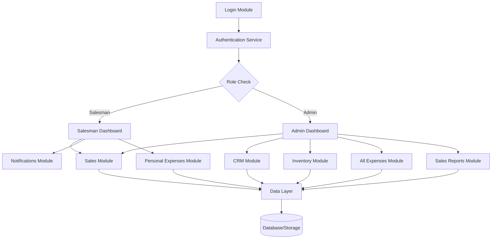

# Design Document - ZERO Business Management System

## Overview

The ZERO Business Management System is a role-based point-of-sale and business management desktop application built with Python and PySide6 (Qt for Python). The system provides distinct interfaces for salesmen and administrators, with shared authentication and role-based access control. The architecture emphasizes modularity, security, and user experience through a clean separation of concerns between different business functions.

**Key Design Principles:**
- Role-based access control with clear separation between salesman and admin capabilities
- Modular architecture with dedicated modules for each business function
- PySide6-based desktop UI for native performance and cross-platform compatibility
- Local SQLite database for data persistence and offline capability
- Real-time data updates and notifications
- Cross-platform deployment with bundling support for Mac and Windows

## Architecture

### High-Level Architecture



### Module Structure

The system follows a modular architecture with the following components:

- **main.py**: Application entry point and routing logic
- **login.py**: Authentication and session management
- **dashboard.py**: Role-based dashboard rendering
- **sales.py**: Sales transaction processing
- **crm.py**: Customer relationship management
- **inventory.py**: Inventory management and tracking
- **expenses.py**: Expense tracking and management
- **notifications.py**: Alert and notification system
- **utils.py**: Shared utilities and helper functions
- **styles.py**: UI styling and theming

## Components and Interfaces

### Authentication Component

**Purpose**: Secure user authentication and role-based access control

**Key Features**:
- Username/password authentication
- Session state management
- Role determination (salesman/admin)
- Password recovery mechanism
- Company branding integration

**Interface Design**:
- Clean login window with company logo background
- "ZERO" system branding in header
- Error message display for invalid credentials
- Forgot password functionality
- Native desktop window with proper window controls

**Design Rationale**: Centralized authentication ensures security consistency across the application while providing a professional branded experience. PySide6 provides native desktop integration and professional appearance.

### Sales Processing Component

**Purpose**: Handle all sales transactions with support for different payment methods and customer types

**Key Features**:
- Product selection and pricing
- Multiple unit types with toggle selection
- Quantity adjustment with +/- controls
- Automatic discount calculation
- Payment method selection
- Customer information capture for credit sales
- Shopping cart management
- Transaction history tracking

**Interface Design**:
- Intuitive product entry form
- Real-time price calculation
- Visual cart summary with modification options
- Streamlined checkout process

**Design Rationale**: The sales interface prioritizes speed and accuracy for high-volume transaction processing while maintaining flexibility for different sale types.

### Customer Relationship Management (CRM) Component

**Purpose**: Comprehensive customer data management and transaction tracking

**Key Features**:
- Customer registration with detailed information capture
- Customer list with financial status overview
- Complete transaction history per customer
- Debt vs payment tracking
- Contact information management

**Data Model**:
- Customer profile: Name (first, middle, last), company, contact details
- Transaction history: Date, amount, payment status, outstanding balance
- Communication channels: Mobile, email, WhatsApp

**Design Rationale**: The CRM design focuses on providing administrators with complete customer visibility while maintaining data integrity and ease of access.

### Inventory Management Component

**Purpose**: Comprehensive inventory tracking with automated alerts and reporting

**Key Features**:
- Product catalog with barcode integration
- Stock level monitoring
- Price management (buying/selling prices)
- Expiry date tracking
- Minimum quantity alerts
- Inventory movement history
- Unit specification management

**Interface Design**:
- Tabular product display with key metrics
- Detailed product views with full information
- Historical movement tracking with time-based filtering
- Alert indicators for low stock and expiring products

**Design Rationale**: The inventory system balances comprehensive tracking capabilities with user-friendly interfaces, ensuring both detailed oversight and quick operational decisions.

### Notification System Component

**Purpose**: Proactive business intelligence and alert management

**Key Features**:
- Inventory-based alerts (low stock, expiring products)
- Business trend notifications
- Role-specific notification filtering
- Real-time alert generation

**Design Rationale**: The notification system provides actionable intelligence to users based on their roles, helping prevent stockouts and product waste while keeping users informed of business trends.

### Expense Management Component

**Purpose**: Comprehensive expense tracking with role-based access control

**Key Features**:
- Personal expense tracking for salesmen
- Organization-wide expense visibility for admins
- Expense categorization and details
- User attribution and tracking

**Design Rationale**: The dual-level expense system allows personal accountability for salesmen while providing administrators with complete financial oversight.

## Data Models

### User Model
```python
class User:
    username: str
    password_hash: str
    role: str  # 'salesman' or 'admin'
    first_name: str
    last_name: str
    created_at: datetime
```

### Customer Model
```python
class Customer:
    customer_id: str
    first_name: str
    middle_name: str (optional)
    last_name: str
    company_name: str (optional)
    mobile: str
    email: str
    whatsapp: str
    address: str
    created_at: datetime
    total_debt: float
    total_payments: float
```

### Product Model
```python
class Product:
    product_id: str
    barcode: str
    name: str
    selling_price: float
    buying_price: float
    current_quantity: int
    minimum_quantity: int
    unit_type: str
    expiry_date: datetime (optional)
    created_at: datetime
```

### Transaction Model
```python
class Transaction:
    transaction_id: str
    customer_id: str (optional for cash sales)
    salesman_id: str
    products: List[TransactionItem]
    payment_method: str
    total_amount: float
    discount_amount: float
    transaction_type: str  # 'cash' or 'credit'
    created_at: datetime
```

### Expense Model
```python
class Expense:
    expense_id: str
    user_id: str
    amount: float
    description: str
    category: str
    created_at: datetime
```

## Error Handling

### Authentication Errors
- Invalid credentials: Display user-friendly error message
- Session timeout: Redirect to login with appropriate message
- Role access violations: Prevent access and log security events

### Data Validation Errors
- Required field validation with inline error messages
- Numeric field validation for prices and quantities
- Date validation for expiry dates and transaction dates

### Business Logic Errors
- Insufficient inventory: Prevent overselling with clear error messages
- Invalid discount amounts: Validate discount ranges and display errors
- Customer data conflicts: Handle duplicate customer registration attempts

### System Errors
- Database connection failures: Graceful degradation with user notification
- File system errors: Backup mechanisms and error recovery
- Application crashes: Automatic recovery and state preservation
- Cross-platform compatibility issues: Platform-specific error handling

## Testing Strategy

### Unit Testing
- Individual component testing for all business logic functions
- Data model validation testing
- Authentication and authorization testing
- Calculation accuracy testing (pricing, discounts, totals)

### Integration Testing
- End-to-end transaction flow testing
- Role-based access control verification
- Database integration testing
- Session management testing

### User Acceptance Testing
- Role-specific workflow testing
- Performance testing under typical load conditions
- UI/UX testing for usability and accessibility
- Cross-platform compatibility testing (Mac/Windows)

### Test Data Management
- Automated test data generation for various scenarios
- Test database isolation and cleanup
- Mock data for external dependencies
- Performance benchmarking with realistic data volumes

### Automated Testing Pipeline
- Continuous integration with automated test execution
- Code coverage reporting and enforcement
- Regression testing for all major releases
- Security vulnerability scanning